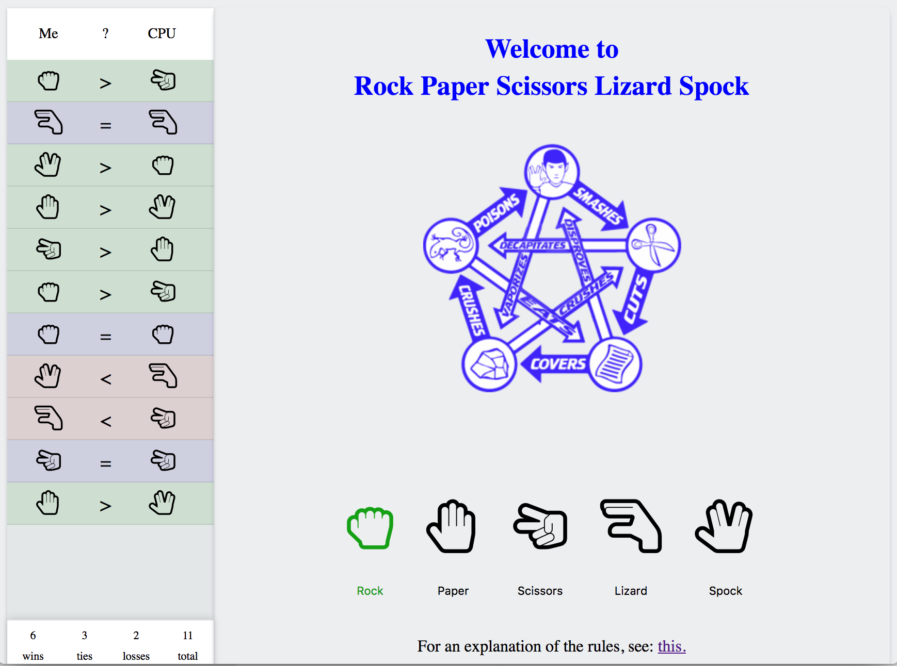

# Rock Paper Scissors Lizard Spock

First of all I stole a lot of this from Austin Paquette [codepen](http://codepen.io/mur/pen/wKGrPX). I made several changes including converting the styling to use Flexbox.

You can go [here](https://drmikeh.github.io/rock-paper-scissors-lizard-spock/) to play the game.

## Screen Shot

## Technologies Uses

### Runtime Dependencies

* [HTML5](https://www.w3schools.com/html/html5_intro.asp)
* [CSS3](https://www.w3schools.com/css/css3_intro.asp)
* [Flexbox](https://www.w3schools.com/css/css3_flexbox.asp)
* [JavaScript (ES-2015)](https://www.w3schools.com/js/)
* [jQuery](https://jquery.com/)
* [Font Awesome](http://fontawesome.io/)
* [animate.css](https://daneden.github.io/animate.css/)

### Buildtime Dependencies / Tools

* The [Yeoman](http://yeoman.io/) [WebApp Generator](https://github.com/yeoman/generator-webapp) (for scaffolding)
* [gulp](http://gulpjs.com/)
* [node-sass](https://github.com/sass/node-sass)
* [eslint](http://eslint.org/)
* [babel](https://babeljs.io/)
